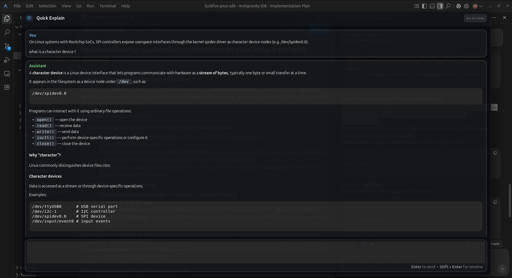

# Quick Explain — Ubuntu System-Wide LLM Text Explanation Tool

<p align="center">
  
</p>

<p align="center">
  
</p>

**Quick Explain** is a lightweight, global desktop utility for Ubuntu 24 (Wayland) that lets you select any text across any application (`Ctrl+C`), press **`Ctrl+Shift+E`**, and instantly get a beautifully formatted LLM explanation in a centered 50% transparent dark floating pane.

---

## ✨ Features

- **Global Hotkey (`Ctrl+Shift+E`)**: Select text anywhere -> `Ctrl+C` -> `Ctrl+Shift+E` opens Quick Explain instantly.
- **Centered Floating Glassmorphic Pane**: 50% opacity, dark black background (`#0b0c10`), rounded corners (`16px`), auto-sized to 70% of screen dimensions.
- **Context-Aware Multi-Turn Chat**: Powered by OpenAI's Responses API (`previous_response_id`), allowing follow-up questions within the same window.
- **Native GTK4 Markdown Renderer**: Render Markdown tables (`Gtk.Grid`), fenced code blocks (`Gtk.TextView`), lists, blockquotes, horizontal dividers, and high-contrast inline code badges without heavy browser dependencies.
- **Editable System Prompt**: Edit [`system_prompt.txt`](system_prompt.txt) at any time — changes reload live without restarting the app.
- **Keyboard Friendly**:
  - `Enter`: Send message
  - `Shift + Enter`: Insert newline
  - `Esc`: Close window
- **Ubuntu Dock Integration**: Displays custom application icon in the GNOME Shell dock.

---

## 🛠️ System Requirements

- **Operating System**: Ubuntu 24.04 LTS (Wayland Session)
- **Dependencies**: Python 3.12, PyGObject (`python3-gi`, `python3-gi-cairo`, `gir1.2-gtk-4.0`), `wl-clipboard` (`wl-paste`).

---

## 🚀 Quick Setup & Installation

### 1. System Package Requirements
Install GTK4 PyGObject bindings and Wayland clipboard utility:
```bash
sudo apt update
sudo apt install python3-gi python3-gi-cairo gir1.2-gtk-4.0 wl-clipboard
```

### 2. Set Up Virtual Environment
Create the Python virtual environment with access to system PyGObject packages:
```bash
python3 -m venv --system-site-packages .venv
source .venv/bin/activate
pip install -r requirements.txt
```

### 3. Configure API Key
Create or edit your `.env` file:
```env
OPENAI_API_KEY=sk-your-openai-api-key
OPENAI_MODEL=gpt-5.6-luna

# UI Customizations
WINDOW_OPACITY=0.5
WINDOW_WIDTH_RATIO=0.7
WINDOW_HEIGHT_RATIO=0.7
WINDOW_DECORATED=false
```

### 4. Enable Global Shortcut (`Ctrl+Shift+E`)
Run the setup script to register the global shortcut and Ubuntu Dock icon:
```bash
./setup_shortcut.sh
```

---

## 🎯 Usage Workflow

1. **Select text** anywhere (terminal, VS Code, web browser, PDF, log file, documentation).
2. Press **`Ctrl+C`**.
3. Press **`Ctrl+Shift+E`**.
4. The Quick Explain window appears centered on your screen with the copied text pre-filled and cursor focused at the end:
   - Press **`Enter`** to get an immediate explanation.
   - Or type a question/instruction at the end and press **`Enter`**.
5. Ask follow-up questions in the same window.
6. Press **`Esc`** to dismiss.

---

## 📁 Repository Structure

```
├── app.py                         # Main GTK4 application & Markdown rendering engine
├── config.py                      # Configuration loader (.env and system_prompt.txt)
├── system_prompt.txt              # Customizable system prompt
├── launch.sh                      # Shell launcher for global shortcut execution
├── setup_shortcut.sh              # Automatic GNOME shortcut & desktop installer
├── com.quickexplain.app.desktop   # Linux Desktop Entry file
├── requirements.txt               # Python package dependencies
├── assets/
│   └── logo.png                   # Application icon logo
├── AGENTS.md                      # AI Agent & Developer Architecture Guide
└── README.md                      # Documentation
```

---

## 🤖 AI Agent & Developer Notes

For architecture diagrams, thread safety guidelines, and extension rules for AI agents, see [`AGENTS.md`](AGENTS.md).
